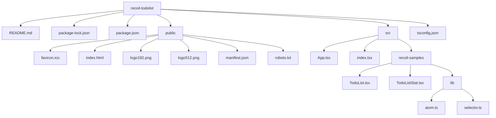

# Recoil Todolist

このプロジェクトは、Recoilという状態管理ライブラリを使って作成された Todolist アプリです。
Recoil は Facebook が開発した状態管理ライブラリで、React アプリケーションの状態管理をより簡単に行うことができます。

## インストール

このプロジェクトを動かすには、まず Node.js をインストールしてください。
その後、以下のコマンドを実行して、必要なパッケージをインストールしてください。

```
npm install
```

## 実行方法

以下のコマンドを実行することで、アプリを起動することができます。

```
npm start
```

## 使用技術

このアプリは、以下の技術を使って作成されています。

- React
- Recoil
- TypeScript
- Material UI

## コンフィグレーション

このプロジェクトのディレクトリ構成は以下のようになっています。



また、このプロジェクトで使用されているライブラリのバージョンは以下のとおりです。

```json
{
  "name": "recoil-todolist",
  "version": "0.1.0",
  "private": true,
  "dependencies": {
    "@emotion/react": "^11.11.0",
    "@emotion/styled": "^11.11.0",
    "@mui/icons-material": "^5.11.16",
    "@mui/material": "^5.13.0",
    "@testing-library/jest-dom": "^5.16.5",
    "@testing-library/react": "^13.4.0",
    "@testing-library/user-event": "^13.5.0",
    "@types/jest": "^27.5.2",
    "@types/node": "^16.18.29",
    "@types/react": "^18.2.6",
    "@types/react-dom": "^18.2.4",
    "react": "^18.2.0",
    "react-dom": "^18.2.0",
    "react-scripts": "5.0.1",
    "recoil": "^0.7.7",
    "typescript": "^4.9.5",
    "web-vitals": "^2.1.4"
  },
  "scripts": {
    "start": "react-scripts start",
    "build": "react-scripts build",
    "test": "react-scripts test",
    "eject": "react-scripts eject"
  },
  "eslintConfig": {
    "extends": [
      "react-app",
      "react-app/jest"
    ]
  },
  "browserslist": {
    "production": [
      ">0.2%",
      "not dead",
      "not op_mini all"
    ],
    "development": [
      "last 1 chrome version",
      "last 1 firefox version",
      "last 1 safari version"
    ]
  }
}
```